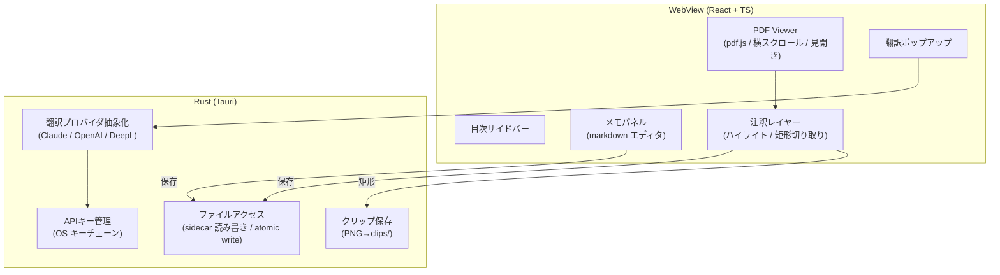

# Papyrus 設計ドキュメント

「最強のPDF viewer」([#1](https://github.com/coyotekojote/papyrus/issues/1)) の全体設計。

## 決定事項

| 項目 | 決定 | 理由 |
|---|---|---|
| 基盤技術 | Tauri 2 (Rust + WebView) | 1コードベースで macOS / Windows / iOS。サクサク動く要件に合致 |
| フロントエンド | React + TypeScript + Vite | pdf.js との統合実績、エコシステム |
| PDFレンダリング | pdf.js（将来 pdfium 移行の余地を残す） | テキストレイヤー・目次取得込みで実装コスト最小。ビューアはインターフェースで抽象化し、性能不足なら Rust 側 pdfium に差し替え可能にする |
| メモ・注釈の保存 | PDF横のサイドカーファイル | iCloud Drive に置けば PC⇔iOS が自動同期。「ファイルをどこに置くか」問題を解決。Obsidian 等からもメモが読める |
| 翻訳 | プロバイダ選択式（Claude / OpenAI / DeepL） | 抽象化レイヤーを Rust 側に置き、APIキーは OS キーチェーンに保存 |

## データレイアウト

PDF と同じフォルダにサイドカーを置く。ユーザーが iCloud Drive 上のフォルダを選べば同期は OS 任せ。

```
📁 Papers/                  ← ユーザーの任意フォルダ（iCloud Drive 推奨）
  attention-is-all-you-need.pdf
  attention-is-all-you-need.papyrus/
    notes.md                ← markdown メモ（他ツールからも読める素の md）
    annotations.json        ← ハイライト・線引きデータ
    clips/
      clip-0001.png         ← 切り取った図
```

### annotations.json スキーマ（v1）

```jsonc
{
  "version": 1,
  "highlights": [
    {
      "id": "uuid",
      "page": 3,
      "rects": [{ "x": 0.1, "y": 0.2, "w": 0.5, "h": 0.02 }], // ページサイズで正規化した座標
      "color": "yellow",
      "text": "抽出されたテキスト",
      "createdAt": "2026-08-01T00:00:00Z"
    }
  ],
  "clips": [
    {
      "id": "uuid",
      "page": 5,
      "rect": { "x": 0.1, "y": 0.3, "w": 0.4, "h": 0.3 },
      "file": "clips/clip-0001.png",
      "createdAt": "2026-08-01T00:00:00Z"
    }
  ]
}
```

- 座標は正規化（0〜1）で保持し、ズーム・デバイス非依存にする
- 書き込みは atomic write（tmp に書いて rename）で iCloud 同期中の破損を防ぐ

### アプリ設定（PDFに紐づかないもの）

サイドカーは「その PDF のもの」だけを持つ。アプリ全体の設定は OS の config ディレクトリの
`settings.json`（デフォルト綴じ方向・表示モード、翻訳プロバイダ、翻訳先言語、メモへの章立て
自動挿入・カーソル追従の on/off）に置き、同じく atomic write する。手で編集できる素の JSON
なので、読み込みはフィールド単位でデフォルトにフォールバックする。

APIキーはここには書かない。OS のキーチェーン（macOS/iOS は Keychain Services、Windows は
Credential Manager、Linux は Secret Service）に Rust 側が保存し、WebView には渡さない。
フロントから呼べるのは「保存」「削除」「設定済みかどうか」の3つだけで、キーを読み出す
コマンドは用意しない。

## アーキテクチャ



### 責務分担

- **フロントエンド**: レンダリング、UI状態（ページ送り・見開き・綴じ方向）、注釈の描画と編集
- **Rust側**: ファイルI/O 一切（sidecar 読み書き、atomic write、クリップPNGの採番と保存）、外部API呼び出し（CORS回避 & キーをWebViewに渡さない）、APIキーのキーチェーン保存

## 主要機能の設計方針

### PDF表示（#1 の中核要件）

- 横スクロールでのページ送り。単ページ / 見開きをトグル
- 左綴じ / 右綴じ切替（見開き時のページ組と、スクロール方向の反転）
- ページは仮想化して前後数ページのみレンダリング + キャッシュ（サクサク要件）。
  キャッシュ戦略（ピクセルバジェット・方向プリフェッチ）とベンチ結果は
  [docs/performance.md](./performance.md) 参照（#12）

### ハイライト → 抽出

- pdf.js のテキストレイヤー上で選択 → 選択範囲の rect 群と文字列を annotations.json に保存
- ハイライト一覧から「メモに挿入」で notes.md に引用として追記

### 図の切り取り

- 矩形選択モード → 該当ページを高解像度レンダリング → 矩形部分を PNG 保存 → notes.md に `` を挿入
- レンダリングはフロント側で行う（pdf.js が既にページを持っているため）。ビューポートをオフセットして矩形部分だけを描画し、PNG のバイト列を Rust に渡す。Rust は採番（`clip-NNNN.png`）と atomic write だけを担当する
- プレビューの画像は WebView が直接読めないので、Rust から読み出したバイト列を blob URL にして表示する（asset プロトコルを開けるより狭く、iOS でも同じ経路）

### 翻訳

- テキスト選択 → ポップアップの「翻訳」→ Rust 側プロバイダ経由で翻訳 → 結果表示 & メモへの挿入
- Rust に `TranslationProvider` trait を定義し、Claude / OpenAI / DeepL 実装を用意。
  trait は「リクエストの組み立て」「レスポンスの解釈」だけを持つ純粋な口にし、HTTP 送信は外に置く。
  こうするとネットワークもAPIキーも使わずに各プロバイダの挙動をテストできる
- LLM系プロバイダには前後の文脈も渡して訳質を上げる。文脈はテキストレイヤーから取り、
  「訳す対象」と「文脈」をプロンプト上で区別する（DeepL は同じ用途の `context` パラメータに渡す）
- プロバイダ・翻訳先言語・モデルは Rust 側で `settings.json` から読む。フロントは選択テキストと
  その前後だけを渡すので、設定画面との同期を持たない
- 失敗はキー未設定 / モデル未設定 / 認証 / レート制限 / 障害 / ネットワーク / 拒否に分けて返し、
  「待てば直るのか、設定を直すのか」が読み手に伝わるようにする
- メモには原文の引用（ページ番号つき）と訳文を並べて残す。訳文だけでは後から検証できないため

### 音声入力（nice to have）

- OS 標準のディクテーション（macOS / iOS ともテキストフィールドで利用可）に乗る方針（issue #13 で確定）
- メモパネルに「音声入力」ボタンを追加。ボタン自体は認識を開始しない（WKWebView では Web Speech API が使えず、OS ディクテーションを JS から起動する公開 API もないため）。押すと編集欄へフォーカスし、OS ごとの起動方法（macOS: fn キー2回 / メニュー「編集 > 音声入力を開始」、iOS: キーボードのマイクボタン）を案内するのみ（`src/notes/dictation.ts` / `NotesPanel.tsx`）
- 実機評価で精度・起動の手間が不足すると分かった場合は Whisper API（OpenAI `audio/transcriptions`）の追加を検討。採用時は翻訳と同じ構成（キーは keychain、HTTP は Rust 側、プロバイダは pure な build/parse でテスト）に従い、案内ボタンを録音トリガーに差し替える。ローカル Whisper（whisper.cpp 等）は依存が重く見送り

### iOS 対応

- Tauri 2 の iOS ターゲットでビルド
- ファイルアクセスは document picker + security-scoped bookmark。iCloud Drive のフォルダを選択して永続アクセス
- タッチ操作（スワイプでページ送り、ピンチズーム）対応

## 実装フェーズと issue 分割

```
Phase 1: 基盤        → #2 プロジェクトセットアップ / #5 サイドカーファイル基盤
Phase 2: ビューア     → #3 PDF表示コア → #4 目次サイドバー
Phase 3: 注釈・メモ   → #6 ハイライト → #7 メモパネル → #8 図の切り取り
Phase 4: 翻訳        → #9 設定・APIキー管理 → #10 翻訳機能
Phase 5: マルチデバイス → #11 iOS対応
Phase 6: 磨き込み     → #12 パフォーマンス最適化 / #13 音声入力(optional)
```

依存関係: #2 → #3 → {#4, #6, #8} 、{#5, #6} → #7 、#9 → #10 、#11 はコア機能後
